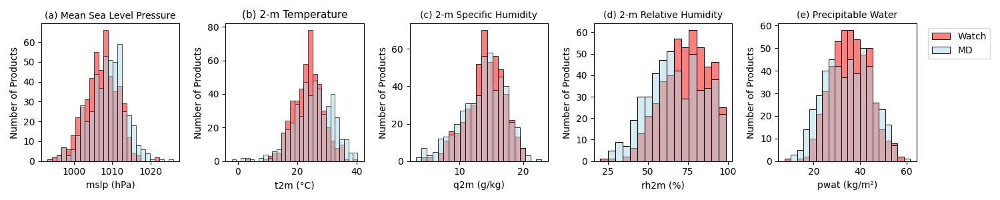
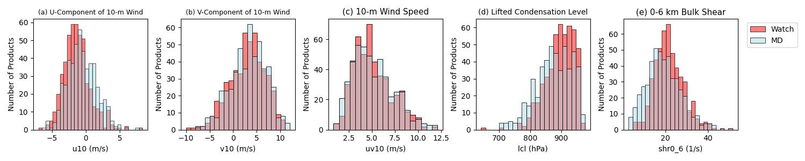
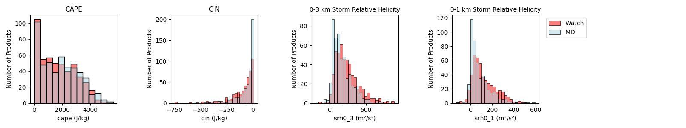
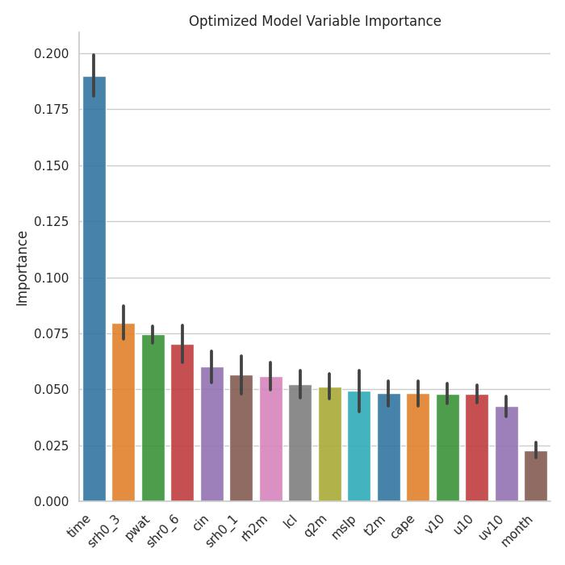

# Assessing the Applicability of Machine Learning Models in Predicting Potential SPC Severe Weather Watches in Central Oklahoma

Authors: Nathan Sonntag and Tyson Stewart

#### Required (and Tested) Packages
- cartopy 0.21.1
- csv 1.0
- geopandas 0.11.0
- joblib 1.1.0
- matplotlib 3.5.1
- metpy 1.3.1
- numpy 1.21.5
- pandas 1.5.3
- scipy 1.9.1
- seaborn 0.12.2
- sklearn 1.1.1
- urllib3 1.26.9
- xarray 0.20.1

### Introduction

Within meteorological spaces, there has been an increasing amount of discussion as to how, if at all, machine learning (ML) models can be incorporated into research and forecasting operations. While most of this effort has come to fruition in the form of ML-enhanced numerical models (Lam et al. 2023; Price et al. 2024), research has been limited regarding the use of ML models to help with nowcasting operations. This project seeks to remedy some of these deficiencies by developing an ML model with the goal of predicting whether a severe weather watch will be issued for a given region or not. By doing this, we hope that this can serve as a potential proof of concept towards future models that can help forecasters nowcast areas of concern.

### Background

Prior literature on the usage of ML models in the meteorological space seems to mostly be consistent of two major categories. The first is the augmentation of numerical weather prediction (NWP). Traditionally, NWP involves taking a set of initial conditions (often referred to as “boundary conditions”) and performing a series of mathematical formulas and calculations to determine how any weather patterns will develop in the future (Waqas et al. 2024). This process, while validated across decades of use, is very computationally intensive, limiting the types of users and use-cases that it is effective for. One proposed way to combat this computational resource dilemma has been to create NWP models that are aided with ML processes. The rationale behind this being that ML models can use their ability to excel at pattern recognition to offload some of the raw computational work from NWP models. Several attempts at such a hybrid system have already been created with varying methodologies and results (Lam et al. 2023; Price et al. 2024; Bouallègue et al. 2024; Waqas et al. 2024).

The other major area of meteorological ML research has been in regard to the subject of whether ML models can supplementally assist with forecasting operations. Such research has looked at whether ML models can take atmospheric data from observations and numerical weather model analyses, and leverage pattern recognition to help forecast specific types of severe weather (Hill et al. 2020; Chkeir et al. 2023). While much of this research has been targeted on specific storm types, said research is broad in terms of study area scope (Hill et al. 2020; Prudden et al. 2020; Albu et al. 2022; Yao et al. 2022; Chkeir et al. 2023). There is seemingly a lack of research done on local to regional scale nowcasting ML models, a subject we seek to address. The goal of this project, therefore, is to create an ML model with data for a specific National Weather Service weather forecast office (WFO) region that attempts to predict whether a severe weather watch should/will be issued.

### Data

Data for this project will consist of two major parts. The first is a collection of all SPC mesoscale discussions (MDs) and watches for central Oklahoma from 2014-2024 filtered for severe weather only (excluding floods and winter weather events). For this study, central Oklahoma is centered on Oklahoma County, OK, and contains this and any county that shares a border with Oklahoma County. This data, while theoretically able to be pulled from the SPC directly, has been chosen to be acquired from the Iowa Environmental Mesonet’s (IEM) archival services for ease of use. Through IEM, we can obtain a shapefile containing all watches and MDs for our study region and time period and then use the product IDs included for each MD/watch to acquire and insert the relevant textual data through IEM’s SPC text archive. This textual data includes information on weather type, watch probability, and product type, which we can use to filter and group each MD/watch into their respective category.
The second group of data to be acquired is the atmospheric data that will be used to train the model, test, and validate the model in conjunction with the SPC data. For our purposes we have elected to use the Rapid Refresh (RAP) model analysis, as it consists of hourly, high-definition atmospheric data for North America. RAP analysis also includes many of the variables previously established in prior literature to be relevant to ML analysis of severe weather (Hill et al. 2020), further justifying its use case here. Given the hourly interval, RAP analysis data for the nearest hour prior to the MD or watch will be utilized. This is to avoid “overshooting” of the environmental conditions that might happen if we were to choose the data after the MD was issued.


### Methodology
#### a. Data Preprocessing

During the filtering of Storm Prediction Center (SPC) products over central Oklahoma, products were also filtered by product type (either as an MD or as a watch). This was done to create the two ‘labels’ that the ML model will try to predict based on the average environmental variables obtained from RAP analysis. Once the climatology of SPC products was obtained and filtered, each product was environmentally analyzed using RAP analysis obtained from the National Center for Environmental Information Thredds server (https://www.ncei.noaa.gov/thredds/catalog.html). For each product, a total of 14 variables were obtained directly from the RAP analysis itself or calculated using MetPy functions (https://unidata.github.io/MetPy/latest/index.html). The selection of the 14 variables follows closely those used in a severe weather prediction Random Forest (RF) model produced by Hill et al. (2020) and are listed in Table 1. Each of these variables were averaged over all grid points within a 60-km radius of downtown Oklahoma City and filtered to not include any grid points that have a composite reflectivity of 30 dBz or greater (Fig. 1). Furthermore, if a file was either missing variables or missing entirely from the Thredds database, that product was filtered out of the final dataset for ML training and testing. 

***Table 1: Environmental Variables and Acronyms***

| Environmental Variable                     | Acronym       |
|--------------------------------------------|---------------|
|     2-m Temperature                        |     t2m       |
|     2-m Specific Humidity                  |     q2m       |
|     2-m Relative Humidity                  |     rh2m      |
|     10-m U-Component Wind                  |     u10       |
|     10-m V-Component wind                  |     v10       |
|     10-m Wind Speed                        |     uv10      |
|     Mean Sea-Level Pressure                |     mslp      |
|     Precipitable Water                     |     pwat      |
|     Lifted Condensation Pressure Level     |     lcl       |
|     Surface-Base CAPE                      |     cape      |
|     Surface-Based CIN                      |     cin       |
|     0-6 km Bulk Shear                      |     shr0_6    |
|     0-1 km Storm Relative Helicity         |     srh0_1    |
|     0-3 km Storm Relative Helicity         |     srh0_3    |


> Figure 1: Domain of study area centered over Oklahoma City with a 60 km radius

#### b.	Random Forest Testing and Training

Given the tabular nature of the data collected, an RF model was determined to be the best predictive tool. RF models have been used to great success in the past in the prediction of severe weather conditions (Hill et al. 2020, Loken et al. 2022). As a result, it was determined that this model would likely also perform well for similar purposes in this research. The dataset of MDs and watches was randomly split using the best methods into a 70/10/20% ratio for training, validation, and testing, respectively. As an initial base model, all environmental variables, including month and time of product occurrence from the MD dataset, were used with only the default Random Forest parameters. After the base model was analyzed using the validation dataset, a grid search algorithm was used to search for the best hyperparameters to tune the model for maximum accuracy. The following optimized RF model was analyzed and compared to the base model using the validation data to determine potential advantages and limitations of the hypertuned model. Finally, the optimized model was tested using the testing dataset and perturbed using ten different random states to display the potential range of model variability. These perturbed models were then analyzed using a mean classification report with 95% confidence intervals calculated to display the confidence range, and the mean importance of environmental variables and MD metadata was analyzed to determine which parameters had the greatest effect. 

### Results
#### a. Data Validation

Given that the values using in this study were extracted straight from RAP analysis itself, the data used in the RF model should be valid. However, since the focus of this study is on severe weather discussions and watch issued over central Oklahoma, validation that parameters fit into the general severe weather climatology of the region is still needed.

In the analysis of the temporal distribution of the entire SPC mesoscale discussions and watches combined, the climatology makes sense from a meteorological perspective. From a monthly perspective, the three months with the greatest number of total SPC products are April, May, and June, which is the period of the year with the greatest severe weather frequency in Oklahoma, thus making climatological sense (Fig. 2b). Likewise, the frequency of product issuance, at an hourly level, peaks in the afternoon and early evening hours, also matching well with severe storm climatology (Fig. 2d). Differences at the yearly (Fig. 2a) and daily (Fig. 2c) temporal scales are minimal with respect to SPC products, also indicating that the ML dataset is acceptable from a temporal standpoint with respect to severe weather. 


> Figure 2:  Histograms of distributions of SPC mesoscale discussions and watches over central Oklahoma from 2014 to 2024 based on (a) year of issuance, (b) month of issuance, (c) day of issuance, and (d) hour of issuance

Given the context of the temporal distribution of SPC products over central Oklahoma, the average background environment also makes meteorological sense. The distribution of mean sea-level pressure leans towards more mesoscale features being the cause of many of the SPC products, agreeing with the severe weather climatology of the region (Fig. 3a). Likewise, the 2-m temperature distribution fits the monthly trend of SPC products (Fig. 3b). In terms of environmental moisture, moist levels of surface specific humidity (Fig. 3c.), relative humidity (Fig. 3d), and precipitable water (Fig. 3e) are conducive for clouds and storms to develop. 


> Figure 3: Box plots of average (a) mean sea level pressure, (b) 2-m temperature, (c) 2-m specific humidity, (d) 2-m relative humidity, and (e) precipitable water of SPC mesoscale discussions and watches over central Oklahoma from 2014 to 2024

While 10-m wind and its components (Fig. 4a-c) by themselves don’t offer much in terms of severe weather verification, the values are still reasonable for surface winds and, therefore, can still useful combined with and into other variables for training and testing the RF model. Lifted condensation level (LCL) values are relatively low in the atmosphere based on their distribution, which fits well with severe weather conditions as lower LCLs are beneficial especially for tornadic storms (Fig. 4d). The wide range in 0-6 km bulk shear is expected, due to the importance of shear in determining storm type (Fig. 4e). The bulk of the distribution for the bulk shear was favorable for organized multicell storms which fits the typical storm climatology of the region.


> Figure 4: Box plots of average (a) u-component of 10-m wind, (b) v-component of 10-m wind, (c) 10-m wind speed, (d) lifted condensation pressure level, and (e) 0-6 km bulk shear of SPC mesoscale discussions and watches over central Oklahoma from 2014 to 2024

Moderate CAPE value distribution typically less than 3000 J/kg but more than 750 J/kg makes climatological sense as most SPC products are issued before severe weather occurs (Fig. 5a). Nevertheless, severe weather is possible within this distribution of CAPE and therefore, fits the climatology the dataset desires to capture. The same is true for CIN (Fig. 5b). While the surface-based CIN values are non-zero, the general distribution shows they are minimal enough for the cap to be broken and for convection and severe weather to occur. Finally, for both levels of storm relative helicity (SRH), the distribution of values suggests a mixture of storm modes are possible, including those that could produce tornadoes. All these distributions match the climatology that is desired from this dataset, and, therefore, the dataset should service the desired purpose of separating SPC product types for severe weather. 


> Figure 5: Box plots of average (a) surface-based CAPE, (b) surface-based CIN, (c) 0-3 km storm relative helicity, and (d) 0-1 km storm relative helicity of SPC mesoscale discussions and watches over central Oklahoma from 2014 to 2024

#### b. Environmental Comparison Between Mesoscale Discussions and Watches

Analysis of the temporal properties of all SPC products divided by either watch or MD displayed some interesting trends. For both divisions by year and day, there was no clear trend between the two labels (Fig. 6a,c). However, for both the monthly and hourly temporal analysis, there was a clear seasonal and diurnal trend. For the monthly analysis, a large increase of watches occurred over the months of May and June, the climatologically most active severe weather months for this region (Fig. 6b). For a diurnal trend, MDs tended to occur earlier in the day compared to severe weather watches (Fig. 6d). This too makes both climatological and logistical sense as a MD is usually issued before a watch is issued.  


> Figure 6:  Histograms of distributions of SPC mesoscale discussions and watches over central Oklahoma from 2014 to 2024 based on (a) year of issuance, (b) month of issuance, (c) day of issuance, and (d) hour of issuance divided by SPC label

For surface mean sea-level pressure, the watch label tended to have lower pressures than MDs, indicating that more watches occurred in lower pressures which are climatologically more associated with inclement weather (Fig. 7a). Severe weather watches were more likely than MDs at temperatures up to 30°C and warmer temperatures than that tended to have more MDs than watches (Fig. 7b). This fits well with the seasonal climatology of severe weather in central Oklahoma, with watches more likely in the late spring and early summer compared to the mid- to late-summer. While specific humidity (Fig. 7c) and precipitable water (Fig. 7e) doesn’t have a real trend between labels, higher relative humidities greater than 65% were associated with the watch label than MDs, making meteorological sense that as relative humidity increases, so does thunderstorm potential. 


> Figure 7: Histograms of distributions of SPC mesoscale discussions and watches over central Oklahoma from 2014 to 2024 based on (a) mean sea level pressure, (b) 2-m temperature, (c) 2-m specific humidity, (d) 2-m relative humidity, and (e) precipitable water divided by SPC label

Focusing on wind, the only one of the three surface wind variables that seemed to have some type of trend between labels was the u-component (Fig. 8a). If wind direction was primarily negative (from the east), then the label was more likely to be a watch then an MD and vice versa if the direction was positive (from the west), likely due to an increase of directional shear as upper-level wind are usually westerly. For the lifted condensation level, there is a strong trend with lower LCLs more likely to produce watches than MCs, likely due to the importance of a low LCL in tornadogenesis (Fig. 8d). Furthermore, higher 0-6 km bulk shear values were more likely to be a watch than a MD due to the importance of that variable for supercells with dominate central Oklahoma’s climatological severe storm morphology. Finally, while CAPE and CIN showed no real difference between labels (Fig. 9a,b), storm relative helicity at both 0-3 km and 0-1km levels displayed that higher SRH values lead to more watches than MDs, likely due to the importance of the variable in tornadogenesis.  


> Figure 8: Histograms of distributions of SPC mesoscale discussions and watches over central Oklahoma from 2014 to 2024 based on (a) u-component of 10-m wind, (b) v-component of 10-m wind, (c) 10-m wind speed, (d) lifted condensation pressure level, and (e) 0-6 km bulk shear divided by SPC label


> Figure 9: Histograms of distributions of SPC mesoscale discussions and watches over central Oklahoma from 2014 to 2024 based on (a) surface-based CAPE, (b) surface-based CIN, (c) 0-3 km storm relative helicity, and (d) 0-1 km storm relative helicity divided by SPC label

#### c. Random Forest Model Analysis

The base RF model overall performed fairly well, given that no hyperparameters were used to tune the model. The overall accuracy for the model was 74% with a Brier score of 0.26, indicating that the base model has some predictive value, although those parameters do not condone use outside of a research setting since the model still predicted the incorrect label 25% of the time (Table 2). Analyzing the classification report more closely, recall had a higher percentage than precision for MDs, while the opposite was true for the watches label. This indicates that the model tended to produce false negatives or misses for the watch classification, while the model tended to produce false positives or false alarms for MDs. Given that there were only two labels in this analysis, this result was expected. Nevertheless, values above or only slightly below 70% for precision, recall, and f-score for both labels indicate that this dataset did a good job at producing a result that differentiates between MDs and severe weather watches.

***Table 2: Base Model Classification Report***
|              | Precision | Recall    | F1-Score  | Support   |
|--------------|-----------|-----------|-----------|-----------|
| MDs          | 0.72      | 0.79      | 0.75      | 48        |
| Watchs       | 0.77      | 0.69      | 0.73      | 49        |
|              |           |           |           |           |
| Macro Avg    | 0.74      | 0.74      | 0.74      | 97        |
| Weighted Avg | 0.75      | 0.74      | 0.74      | 97        |
|              |           |           |           |           |
| Accuracy     |           |           | 0.74      | 97        |
| Brier Score  |           |           | 0.2577    | 97        |

The optimized RF model (Table 3) improved upon the base model, but still did not improve it to a point that it could be used reliably. While both the optimized model's accuracy and Brier score improved (accuracy increasing by 3% and Brier score decreasing by a similar quantity), the model still does not predict the correct product outcome over 20% of the time (Table 4). However, the primary benefit of the tuned RF model was in the increase of MD label precision and severe watch label recall, increasing the metrics by 4% and 7%, respectively. 

***Table 3: Configuration of Optimized Random Forest Model***
| Parameter         |          |
|-------------------|--------- |
| criterion         | log loss |
| max depth         | 16       |
| min samples leaf  | 6        |
| min samples split | 4        |
| num estimators    | 40       |

***Table 4: Optimized Model Classification Report***
|              | Precision | Recall    | F1-Score  | Support   |
|--------------|-----------|-----------|-----------|-----------|
| MDs          | 0.76      | 0.79      | 0.78      | 48        |
| Watchs       | 0.79      | 0.76      | 0.77      | 49        |
|              |           |           |           |           |
| Macro Avg    | 0.77      | 0.77      | 0.77      | 97        |
| Weighted Avg | 0.77      | 0.77      | 0.77      | 97        |
|              |           |           |           |           |
| Accuracy     |           |           | 0.77      | 97        |
| Brier Score  |           |           | 0.2268    | 97        |

When analyzing the confusion matrices for both the base and optimized RF models, the reasoning for the better performance of the optimized model could be seen (Fig. 10). While the true label and predicted label distribution remained constant for both the MD predicted MD and MD predicted watch categories, three missed severe weather watches were correctly predicted in the optimized model and not the base RF model. Given that the RF was binary in prediction and label and only has a total validation support of 97 (a relatively small sample size), this accounted for the decent increases in the metrics in Table 4. However, unsurprisingly, this only increased the overall model performance slightly. The Receiver Operating Characteristic (ROC) curves for both the base model and the optimized model were very similar, with the optimized model only slightly outperforming the base model when the true positive rate was between about 0.7 to 0.8 (Fig. 11). This was further reflected in the area under the curve (AUC) which represented the model overall accuracy. While both models had an AUC of greater than 0.8, indicating that the model performed well on the validation data, the optimized RF model only increased the AUC by 0.01, indicating very little gain from the hyperparameterization.


> Figure 10: Validation confusion matrices for the base (left) and optimized (right) Random Forest models


> Figure 11: Validation ROC curves for the base (blue) and optimized (red) Random Forest models

The change in the model between the base and optimized one could be seen when analyzing the model prediction probabilities for the validation dataset (Fig. 12). For the base model, the predicted probabilities created a three-peaked shape, with the highest frequencies boxed between the 0.2-0.3, 0.4-0.5, and 0.7-0.8 bins. This indicated that while the model performed well, there might have been some randomness in the model. There also appeared to be a slight lean towards the MD label. On the other hand, the optimized model appeared to have somewhat more of a normal distribution with one peak from around 0.4-0.7 predicted probability. Of note, while the frequency of a strong model prediction (less than 0.2) for an MD occurred 15 times, the same for a severe weather watch (0.8 or greater) occurred only half as frequently, indicating the optimized model had less confidence in watch identification than MD identification.


> Figure 12: Validation prediction probabilities for the base (left) and optimized (right) Random Forest models

When the optimized RF model is perturbed and applied to the test dataset, both the accuracy and the Brier score of the model decreased compared to the same metrics in the validation dataset (Table 5). While the average metrics (0.69 for accuracy and 0.309 for Brier score) still represent that the model had some ability to distinguish between MD and watch labels, the model can't be relied on to be accurate, as over 30% of the 196 events were incorrectly labeled. Furthermore, while the precision for the MD label and the recall for the watch label remained above 0.7, the recall for MDs and the precision for watches dropped substantially compared to the validation data metrics for the same model configuration. Given a similar distribution to the base dataset, the model might be predicting an increased ratio of severe weather watch misses (false negatives) compared to correctly detected watches.

***Table 5: Final Perturbed Tested Model Classification Report with 95% Confidence Intervals***
|              | Precision      | Recall         | F1-Score       | Support |
|--------------|----------------|----------------|----------------|---------|
| MDs          | 0.734 ± 0.013  | 0.666 ± 0.016  | 0.697 ± 0.011  | 105     |
| Watchs       | 0.650 ± 0.011  | 0.722 ± 0.019  | 0.685 ± 0.012  | 91      |
|              |                |                |                |         |
| Macro Avg    | 0.692 ± 0.011  | 0.692 ± 0.011  | 0.690 ± 0.011  | 196     |
| Weighted Avg | 0.693 ± 0.010  | 0.690 ± 0.011  | 0.690 ± 0.011  | 196     |
|              |                |                |                |         |
| Accuracy     |                |                | 0.690 ± 0.011  | 196     |
| Brier Score  |                |                | 0.309 ± 0.011  | 196     |

Analyzing the features put into the RF models, the most important variable was time (Fig. 13). This made climatological sense as the SPC often issues an MD before issuing a severe weather watch. Of the environmental variables, 0-3 km storm relative helicity, precipitable water, and 0-6 km bulk shear were the most important to the perturbed optimized model. Again, the variables made climatological sense as both 0-3 SRH and 0-6 km bulk shear were important indicators of supercell environments, which dominate central Oklahoma's severe weather climatology, and precipitable water was an important indicator of storm-ready environments. The least important environmental variables were surface wind-based, likely due to the lack of importance that the variables play in severe weather by themselves. The least important feature for the model was month, likely due to the robust severe weather season in central Oklahoma and the not-infrequent occurrences of off-season severe weather over the region.


> Figure 13: Testing dataset variable importance in percentage with standard deviations for the perturbed optimized model

### Conclusion

This study examines the ability of a Random Forest model to predict if the Storm Prediction Center will issue either a mesoscale discussion or a severe weather watch across central Oklahoma. The study utilized an 11-year climatology of SPC MDs and watches differentiated between the two to create two labels, extracted their metadata, and then calculated environmental variables averaged over a 60-km radius of Oklahoma City. The tabular data is then analyzed both as an entire climatology and based on label before a Random Forest model is generated. The final model shows an ability to differentiate between MDs and watch, but it is not accurate enough to be used with a substantial potential for error. The RF model also showcased the importance of the time (hour) of product issuance and as well as environmental variables important for determining supercellular environments. Possible explanations for the decrease in metrics from the validation stage to the testing stage could be explained by either a lack of data to train the model on and/or the complexity of the product the model is trying to predict. While nearly 1000 SPC MDs and watches in a large number, a RF model may need substantially more data to create an accurate model, especially considering how complex weather thermodynamics and that MDs and watches can be subjective based on the person issuing them. For future work, an increase of the dataset size would be prudent to avoid potential overfitting and to try and encapsulate the complexity that is weather.  Future research could also try to take the techniques utilized in this project to other domain and regions of the United States, to determine if a model like this could be used in different severe weather climatologies.  


### References
Albu, A.-I., G. Czibula, A. Mihai, I. G. Czibula, S. Burcea, and A. Mezghani, 2022: NeXtNow: A Convolutional Deep Learning Model for the Prediction of Weather Radar Data for Nowcasting Purposes. Remote sensing, 14, 3890–3890, https://doi.org/10.3390/rs14163890.

Bouallègue, Z., and Coauthors, 2024: The rise of data-driven weather forecasting: A first statistical assessment of machine learning-based weather forecasts in an operational-like context. Bulletin of the American Meteorological Society, 105, https://doi.org/10.1175/bams-d-23-0162.1.

Chkeir, S., A. Anesiadou, A. Mascitelli, and R. Biondi, 2023: Nowcasting extreme rain and extreme wind speed with machine learning techniques applied to different input datasets. Atmospheric Research, 282, 106548, https://doi.org/10.1016/j.atmosres.2022.106548.

Lam, R., and Coauthors, 2023: Learning skillful medium-range global weather forecasting. Science, 382, https://doi.org/10.1126/science.adi2336.

Loken, E. D., A. J. Clark, and A. McGovern, 2022: Comparing and interpreting differently designed random forests for next-day severe weather hazard prediction. Wea. Forecasting, 37, 871–899, https://doi.org/10.1175/WAF-D-21-0138.1.

Waqas, M., U. W. Humphries, B. Chueasa, and A. Wangwongchai, 2024: Artificial Intelligence and Numerical Weather Prediction Models: A Technical Survey. Natural Hazards Research, https://doi.org/10.1016/j.nhres.2024.11.004.

Price, I., and Coauthors, 2024: Probabilistic weather forecasting with machine learning. Nature, 637, https://doi.org/10.1038/s41586-024-08252-9.

Prudden, R., S. V. Adams, D. Kangin, N. H. Robinson, S. V. Ravuri, S. Mohamed, and A. Arribas, 2020: A review of radar-based nowcasting of precipitation and applicable machine learning techniques. arXiv (Cornell University), https://doi.org/10.48550/arxiv.2005.04988.

Yao, S., H. Chen, E. Thompson, and R. Cifelli, 2022: An Improved Deep Learning Model for High-Impact Weather Nowcasting. IEEE Journal of Selected Topics in Applied Earth Observations and Remote Sensing, 15, 7400–7413, https://doi.org/10.1109/jstars.2022.3203398.

## Requirements Document
We identified the following requirements for this project (note some requirements have been modified and/or marked as removed as the project scope has changed):

| PR-01  | Create Mesoscale Discussion Climatology   
|---------|------------| 
| Priority | High |
| Sprint | 1 |
| Assigned To | Nathan |
| User Story   | As a developer of a machine learning model, I need to establish a climatology of mesoscale discussions and watches over Central Oklahoma so I can create the ML model datasets. |                                                                                                                                       | 
| Acceptance Criteria/Requirements | |
| | 1. Climatology dataset must include data for the intended 11-year period (2014-2024)|.
| | 2. Dataset must be in a format that can be easily read and modified either via Python or through software such as QGIS or ArcGIS.|
| Status | ✅ Complete ✅
|| (Validation performed via ArcGIS Pro's tools, not via a script) | 

| PR-02  | Analyze Mesoscale Discussion Climatology   
|---------|------------| 
| Priority | High |
| Sprint | 1 |
| Assigned To | Tyson |
| User Story   | As a developer of a machine learning model, I need to aquire the textual details of each of the individual MDs so that they can be filtered and categorized by storm type and whether or not it's a watch or not. |                                                                                                                                       | 
| Acceptance Criteria/Requirements | |
| | 1. Dataset must categorize each mesoscale discussion (MD) based upon the relevant severe weather type that the MD is for (tornado, severe thunderstorm, flooding, etc.). Storm type data will be acquired via the SPC mesoscale discussion archive provided by the Iowa Environmental Mesonet (IEM).|
| | 2. Dataset must also indicate MD discussion severity as the percentage of likelihood of a watch being issued. Said data will also be acquired via the SPC mesoscale discussion archive provided by IEM.|
| | 3. Resulting dataset must be converted into a csv file to be used in our ML model.|
| Status | ✅ Complete ✅ | |
| Unit Test | | 

```
sub_csv.reset_index(drop=True, inplace=True)

key_list = list(sub_csv.keys())

# Flag variable to raise if a null value is detected
null_flag = 0

#Test each key to ensure all data is present
for i in key_list:
    for j in range(0, (len(sub_csv[i]) - 1)):
        if sub_csv.loc[j, i] == "NaN" or sub_csv.loc[j, i] == "Null" or sub_csv.loc[j, i] == None:
            null_flag = 1
            print(f"NULL VALUE DETECTED AT INDEX {j}!")

if null_flag == 0:
    print("No null values detected. Check passed.")
```
| PR-03  | Find Area Over Where Analysis Takes Place  
|---------|------------| 
| Priority | High |
| Sprint | 1 |
| Assigned To | Nathan |
| User Story   | As a developer, I need to create a script based on reading in a RAP analysis file with Xarray so I can use the Great Circle method to find data points within a certain great-circle distance of a desired geographic point. |                                                                                                                                       | 
| Acceptance Criteria/Requirements | |
| | 1. Xarray can successfully read in the grib2 file with RAP analysis data.|
| | 2. Great-circle equation can successfilly takes latitude and longitude of geographic point and generates radius of desired distance around input geographic point.|
| | 3. Output displayed states number and which grid points that fall within the desired radius.|
| Status | ✅ Complete ✅ | |
| Unit Test | | 
```
def great_circle_test(test_rap_ds):
    '''Test that great circle function generates the correct number of points'''
    
    # Set lat, lon, radius, and constants (do not edit)
    test_num_points = 0
    test_lat = 35
    test_lon = -100
    test_radius = 10
    
    # Convert RAP coordinate units and input latitude and longitude to radians
    test_rap_lat = test_rap_ds.latitude * (np.pi/180)
    test_rap_lon = test_rap_ds.longitude * (np.pi/180)
    test_lat, test_lon = map(radians, [test_lat, test_lon])
    
    # Create array so distance calculation works over entirety of RAP analysis domain
    test_distance = np.zeros((337, 451))
    
    # Calculate great-circle distance equation in km
    for i in range(len(test_rap_ds.latitude)):
        for j in range(len(test_rap_ds.latitude[i])):
            test_distance[i,j] = 6371 * (acos(sin(test_lat) * sin(test_rap_lat[i,j]) + cos(test_lat) * cos(test_rap_lat[i,j]) * cos(test_lon - test_rap_lon[i,j])))
            if test_distance[i,j] <= test_radius:
                test_num_points += 1
                
    # Output error if calculation produces incorrect output
    if (test_num_points == 2):
        pass
    else:
        sys.exit('❌ Error. Calculation not valid. Possible error with RAP grid.')
```

| PR-04  | Download RAP Analysis Data   
|---------|------------| 
| Priority | High |
| Sprint | 2 |
| Assigned To | Tyson |
| User Story   | As a developer of a machine learning model, I need to gather an analysis data set so I have data that I can train my model on. |                                                                                                                                       | 
| Acceptance Criteria/Requirements | |
| | 1. Downloaded files must be in grib2 format and/or readable into model scripts|
| | 2. Downloaded files must contain Central Oklahoma as a part of their domain|
| | 3. Downloaded files must those the closest time to the time the mesoscale discussion was issued |
| Status | ✅ Complete ✅ | 
| Unit Test | | 
```
try:
    # NCEI 13km RAP Non-Operational Archive (Long-Term)
    urllib.request.urlretrieve(f"https://www.ncei.noaa.gov/thredds/fileServer/model-rap130anl-old/{year}{month}/{year}{month}{day}/rap_130_{year}{month}{day}_{hour}00_000.grb2", 
        f"/home/scratch/nsonntag/eae598/rap_data/rap_130_{year}{month}{day}_{hour}00_000.grb2")
    ds_avail_check = 1
    except:
        try:
            # NCEI 13km RAP Operational Archive (Short-Term)
            urllib.request.urlretrieve(f"https://www.ncei.noaa.gov/thredds/fileServer/model-rap130anl/{year}{month}/{year}{month}{day}/rap_130_{year}{month}{day}_{hour}00_000.grb2", 
                f"/home/scratch/nsonntag/eae598/rap_data/rap_130_{year}{month}{day}_{hour}00_000.grb2")
            ds_avail_check = 1
        except:
            # Print Date and Message that Date Isn't Available in Archive
            ds_avail_check = 0
            print(f"{year}/{month}/{day}_{hour}00 ❌ RAP Analysis File Not Avalible in Dataset")
```

| PR-05  | Gather variables from RAP analysis data
|---------|------------| 
| Priority | High |
| Sprint | 2 |
| Assigned To | Nathan |
| User Story   | As a developer of a machine learning model, I need to gather/calculate individual variables from my data set so I can train my model. |                                                                                                                                       | 
| Acceptance Criteria/Requirements | |
| | 1. Scripts must be able to read data files in grib2 format|
| | 2. Scripts must be able to tell which data points are within 60 km of Oklahoma City|
| | 3. Scripts must be able to read or calculate the determined atmospheric variable from the provided data|
| Status | ✅ Complete ✅ |  
| Unit Test | | 
```
tdef rap_variable_test(ds_raw_file, ds_mean_sea, ds_surface, ds_2m, ds_10m, ds_reflect, year, month, day, hour):
    '''Test to make due each RAP analysis file has all desired variables'''
    if ds_raw_file.get('PWAT_P0_L200_GLC0')[130, 200] == np.nan:
        f"{year}/{month}/{day}_{hour}00 ⚠️ Precipitable Water Not Avalible in Dataset"
    if ds_mean_sea.mslma[130, 230] == np.nan:
        f"{year}/{month}/{day}_{hour}00 ⚠️ Mean Sea Level Pressure Not Avalible in Dataset"
    if ds_surface.sp[130, 230] == np.nan:
        f"{year}/{month}/{day}_{hour}00 ⚠️ Surface Pressure Not Avalible in Dataset"
    if ds_surface.cape[130, 230] == np.nan:
        f"{year}/{month}/{day}_{hour}00 ⚠️ Surface Based CAPE Not Avalible in Dataset"
    if ds_surface.cin[130, 230] == np.nan:
        f"{year}/{month}/{day}_{hour}00 ⚠️ Surface Based CIN Not Avalible in Dataset"
    if ds_2m.t2m[130, 230] == np.nan:
        f"{year}/{month}/{day}_{hour}00 ⚠️ 2-m Temperature Not Avalible in Dataset"
    if ds_2m.r2[130, 230] == np.nan:
        f"{year}/{month}/{day}_{hour}00 ⚠️ 2-m Relative Humidity Not Avalible in Dataset"
    if ds_2m.sh2[130, 230] == np.nan:
        f"{year}/{month}/{day}_{hour}00 ⚠️ 2-m Specific Humidity Not Avalible in Dataset"
    if ds_10m.u10[130, 230] == np.nan:
        f"{year}/{month}/{day}_{hour}00 ⚠️ 10-m U-Component Wind Not Avalible in Dataset"
    if ds_10m.v10[130, 230] == np.nan:
        f"{year}/{month}/{day}_{hour}00 ⚠️ 10-m V-Component Wind Not Avalible in Dataset"
    if ds_raw_file.get('VUCSH_P0_2L103_GLC0')[130, 230] == np.nan:
        f"{year}/{month}/{day}_{hour}00 ⚠️ 0-6 km U-Component Wind Shear Not Available in Dataset"
    if ds_raw_file.get('VVCSH_P0_2L103_GLC0')[130, 230] == np.nan:
        f"{year}/{month}/{day}_{hour}00 ⚠️ 0-6 km V-Component Wind Shear Not Available in Dataset"
    if ds_raw_file.get('HLCY_P0_2L103_GLC0')[0][130, 230] == np.nan:
        f"{year}/{month}/{day}_{hour}00 ⚠️ 0-1 km Storm Relative Helicity Not Available in Dataset"
    if ds_raw_file.get('HLCY_P0_2L103_GLC0')[1][130, 230] == np.nan:
        f"{year}/{month}/{day}_{hour}00 ⚠️ 0-3 km Storm Relative Helicity Not Available in Dataset"
    if ds_reflect.refd[130, 230] == np.nan:
        f"{year}/{month}/{day}_{hour}00 ⚠️ Composite Reflectivity Not Avalible in Dataset"
```

| PR-06  | Format RAP analysis data for RF model
|---------|------------| 
| Priority | High |
| Sprint | 2 |
| Assigned To | Nathan |
| User Story   | As a developer of a machine learning model, I need to format the data and variables that I have gathered so I can develop and train my model. |                                                                                                                                       | 
| Acceptance Criteria/Requirements | |
| | 1. RAP data fields must be reduced to just the necessary data required for the model|
| | 2. Data should be formatted into a csv file that can be input into the scikit-learn RF framework |
| Automatic Test | | 
| | Create a script that reads the csv file and checks if all fields/data are present. If not, generate an error showing what is missing.|
| Status | ✅ Complete ✅ | 
|Unit Test ||
```
def csv_test(df):
    '''Test to ensure all environmental data is in csv file and none is missing'''
    if df.isnull().sum().all() == 0:
        print('✅ Data is correctly read in and ready for training!')
    else:
        sys.exit('❌ Error. One or more values are missing. Please check csv file to remove any dates with incomplete environmental values.')
```

| PR-07  | Create Data Subsets for training, verification, and testing datasets
|---------|------------| 
| Priority | High |
| Sprint | 3 |
| Assigned To | Nathan |
| User Story   | As a developer of a machine learning model, we need to create separate datasets for training, verification, and testing to ensure verification and test results are as accurate and valid as possible. |                                                                                                                                       | 
| Acceptance Criteria/Requirements | |
| | 1. RAP dataset must be split into three separate datasets|
| | 2. Each individual dataset must be appropriately scaled in terms of size (See the 70/10/20 rule established in class lecture notes) |
| | 3. Datasets should roughly match the overall distribution to confirm legitimacy and avoid biases |
| Status | ✅ Complete ✅ | 
| Unit Test ||
```
# N/A
```

| PR-08  | Train/Validate RF model
|---------|------------| 
| Priority | High |
| Sprint | 3 |
| Assigned To | Both Members |
| User Story   | As a developer of a machine learning model, we need to train the model using the data and variables that I have gathered so I can predict if the Storm Prediction Center will issue a mesoscale discussion for Central Oklahoma. |                                                                                                                                       | 
| Acceptance Criteria/Requirements | |
| | 1. RF model framework should use scikit-learn framework|
| | 2. Model output should be formatted in such a way that new atmospheric and environmental data can be plugged in, and the model displays output |
| Status | ✅ Complete ✅ | 
| Unit Test ||
```
# N/A
    
```

| PR-09  | Test RF Model
|---------|------------| 
| Priority | Medium |
| Sprint | 3 |
| Assigned To | Both Members |
| User Story   | As a developer of a machine learning model, I need to test the model using past forecast data so I know how well my model does at predicting if the Storm Prediction Center will issue a mesoscale discussion for Central Oklahoma. |                                                                                                                                       | 
| Acceptance Criteria/Requirements | |
| | 1. Model output must be such that it can be directly compared to the SPC mesoscale discussions |
| | 2. Data should contain identical variables as those that were used in model training |
| | 3. Any figures/statistics generated must be in the same format/type between both model output and RAP forecast data (or as similar as reasonably possible) |
| Automatic Test | | 
| | Create a script that generates statistical tables/visualizations (if necessary) to compare model outputs and SPC mesoscale discussions |
| Status | ✅ Complete ✅ | 
| Unit Test ||
```
# N/A
```
